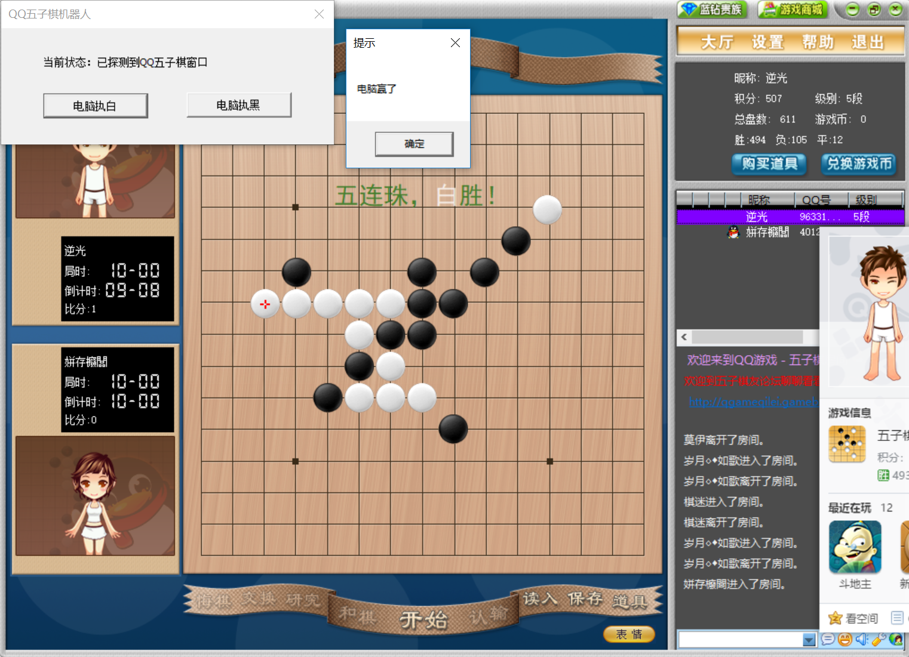

### 项目介绍
本程序为基于项目[https://github.com/kimlongli/FiveChess](https://github.com/kimlongli/FiveChess)中的五子棋AI实现的五子棋辅助，可在qq五子棋中实现自动下棋。随机实战了600多局，胜率达到80%。

### 可执行文件下载
本项目嵌在项目[https://github.com/kimlongli/FiveChess](https://github.com/kimlongli/FiveChess)的可执行文件的1.3版本中，是一个彩蛋程序，具体的打开方式为：
1. 打开五子棋程序。
2. 打开帮助->关于。
3. 点击“关于”窗口上的网址“kimlongli.github.io”即可。

### 运行截图

